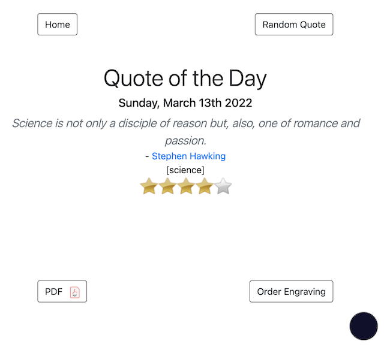
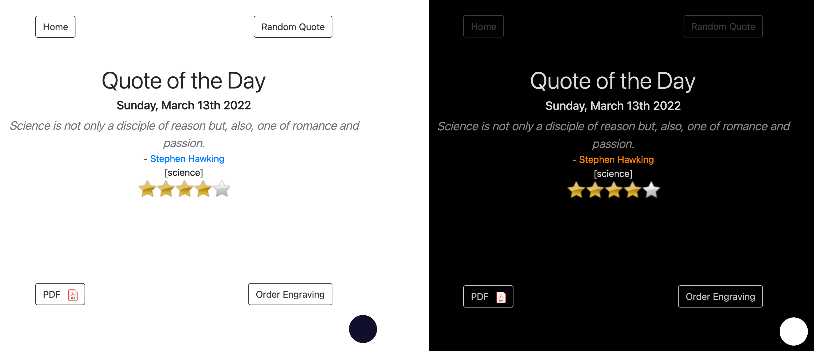
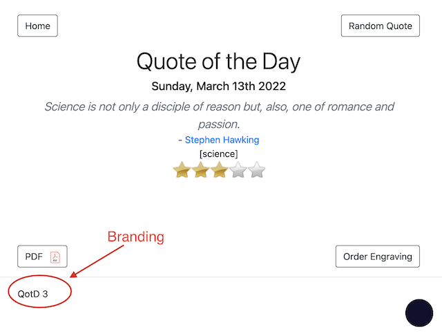
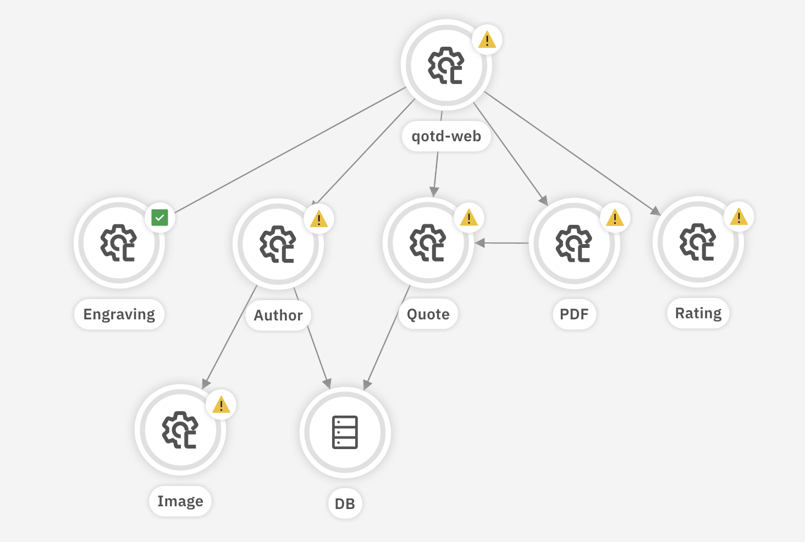

# Quote of the Day - Version 4.0

The Quote of the Day (QotD) application is demonstration micro-service application, designed specifically for use with IBM Watson AIOps and Instana.  It is optionally instrumented for Instana, and provides Prometheus compatible metrics.

## Release notes

The log patterns in this latest release are a little (not completely) different that those of the previous version.  This means re-training of log anomaly models is required.

### What's new

- [X] The internals are a complete re-architecture designed for the most part to support multiple pod replicas for each of the services.  In the previous version if you increased the pod count of a service, only one of the pods would get anomaly instructions.  This means if you have 10 pods implementing the ratings service, for example, when an anomaly is induced, only one of those 10 pods would produce the anomaly.

- [X] The Anomaly generator's manual configuration UI has changed signficantly to support the control of individual pods.

- [X] There is a "darkmode" option on each page (the black/white circle in the lower right corner).

- [X] Dependent loggers can now be attached to specific endpoints.  This means you can add a new log message with the response of an individual endpoint.  For example you can attach a dependent logger to the `/ratings/:id` endpoint.  Everytime this endpoint is called the new log message will be written out.

- [X] Load generator no longer supports a UI.  Since the log generator can have multiple pods running simultaneously, any simple UI would only show the statistics of a single pod.

- [X] There is a new optional environment varaible on the web and anomaly generator components that allows the UI to be "branded" with a simple string (or html).  This was done to support multiple deployments to the same kubernetes cluster (albeit in separate namespaces).  For each deployment the branding string will appear at the bottom left of each screen under a horizontal rule.

### Known issues

The Anomaly Generator user interface for manually editing anomaly configuration is incomplete.  Only the CPU, memory and endpoint latency can be manually adjusted through the UI.

The dark mode option of the app makes some of the text grey (not fully white) and is hard to read.

## What it does

The application itself is very simple.  Navigate to the home page and you will be greeted with a quote from a famous (or nearly famous) person that has been selected for the current day of the year.  The quotes come from a database of over 500 quotes, and have been categorized by genre. Each quote is rated (with a banner of stars). The user can then optionaly request a new random quote, or request the quote in PDF form.  The user can click on the authors link to get a short biography and picture (graciously obtained from wikipedia).  

The final option is to order an engraving of the quote.  This was created to facilitate the tracing through the application to MQ and other middleware.  The engraving service has an environment variable; `SUPPLY_CHAIN_URL` to which a small JSON object is `POST`ed emulating a request to an external service.  This extension has been used to connect to an App Connect Enterprise (ACE) workflow and then to an IBM Message Queue (MQ) server.  Instana is able to capture the flow through all of these components.  In the default install, however the environment variable `SUPPLY_CHAIN_SIMULATE` defaults to `true`, and this external call is not actually made, but the UI does behave the same as if it waws connected.

In this latest release (4.0) the entire application has been refactored and re-architected to support multiple replicas of the individual services.  This enables the application to support increasing loads and overall volume.  The Anomaly Generator has an improved user interface that allows the direct control over some of the possible anomalies; CPU, Memory, Latency.  *At this time, the UI is still being developed to enable direct control over Call Response Status and dependent and independent loggers.*

The most significant change in the app is not in the user interface or user functionality, which has remained the same from the previous version, but rather in the internal architecture.  The common "anomaly" features in each service are now managed as a separate `npm` package.  This new package makes it easier to develop additional services while centralizing the "anomaly" features of the app.

In a small change from the previous version, all author bios and images are now included.  The previous version intentionally left a few out so as to generate the ocassional, and realistic errors.  Now that the ability to directly control the frequency of non 2xx responses, the missing information is no longer needed.  This means that the default installation should produce no internal errors, unless an anomaly has been induced.

In addition to the application itself there is a load generator and anomaly inducer (formerly anomaly generator, or use case generator), that is expected to be deployed with the application.  The load generator continously generates user activity via a headless instance of Firefox that is controlled by Selenium.  Generating a load like this enables the application to embed the Javascript necessary for [Instana Website monitoring](https://www.ibm.com/docs/en/obi/current?topic=instana-monitoring-websites) which is supported.

## Installation

The simplest way to install QotD on Kubernetes is with the Helm 3 chart. You can manually deploy the application with the individual YAML files (editing them as necessary).  A sample set of YAML is provided in the link below.  Finally if you are using the OpenShift built in Prometheus to collect the application metrics, instructions are available via the link below.

[Helm3 Deployment](helm_deployment.md)

[Manual Deployment](manual_deployment.md)

[Prometheus Configuration](prometheus_config.md)

## Architecture

The QotD application is spread out over 7 services and one database, as shown in the figure below.  

The arrows in the diagram indicate a dependency, or more specifically they represent a call from the one component to another.  All calls of this application are HTTP REST calls.

A detailed review of the application architecture is described [here](arch_details.md).

## Load generator

The load generator is Selenium based.  That means the invocations of the actual web application are done with an internal (headless) browser (currently Firefox on Linux). The invocations have realistic delays in them, making a typical use case.  For example the view quote and print pdf, scenario takes about 6 seconds to execute.

There are 7 separate use cases that make up the entire suite that cover all the functionality of the application.  Each of the runs include realistic time delays of about two seconds before the next click is made.  This makes each suite take from 38 to 85 seconds to complete, depending on local conditions and expected variations in application behavior.  

Each run of the suite generates approximately 190 log entries across all the components.  Running at full capacity one instance of the load generator will generate about 17k logs per hour.  You can increase this amount by running multiple instances of the generator. Do this by editing the `qotd-load` Deployment yaml and increase the number of replicas.  To turn off the load generator, set teh number of replicas to 0.

## Anomaly generator

Each component (service) of the application polls the [Anomaly generator](anomaly_generator.md) component to see if it should be exhibiting any anomalous behaviour.

The following are the currently supported anomalous behaviours that can be generated in any of the 6 main application components.

- CPU usage
- Memory Usage
- Latency
- HTTP response codes (i.e. 400, 404, 500, ...)
- Dependent and independent log messages

In addition to these behaviours there is another type of action that can be incorporated into an anomaly scenario (use case).  You can shell out to a host and call a script.

A anomaly scenario (use case) is defined by a JSON object which contains a set of anomaly instructions that are executed on demand from the Anomaly generator UI. The default deployment include four pre-defined anomaly scenarios;

- Quote, PDF, Web, Rating service cascade failure
- Image and Quote Service Issues
- Quote and PDF Service Issues
- Ratings service failures

You can add your own anomalies to the default list included with this app. These anomaly scenarios must be constructed as JSON objects and uploaded to the  application.  See the [Anomaly generator](anomaly_generator.md) documentation for more details.
