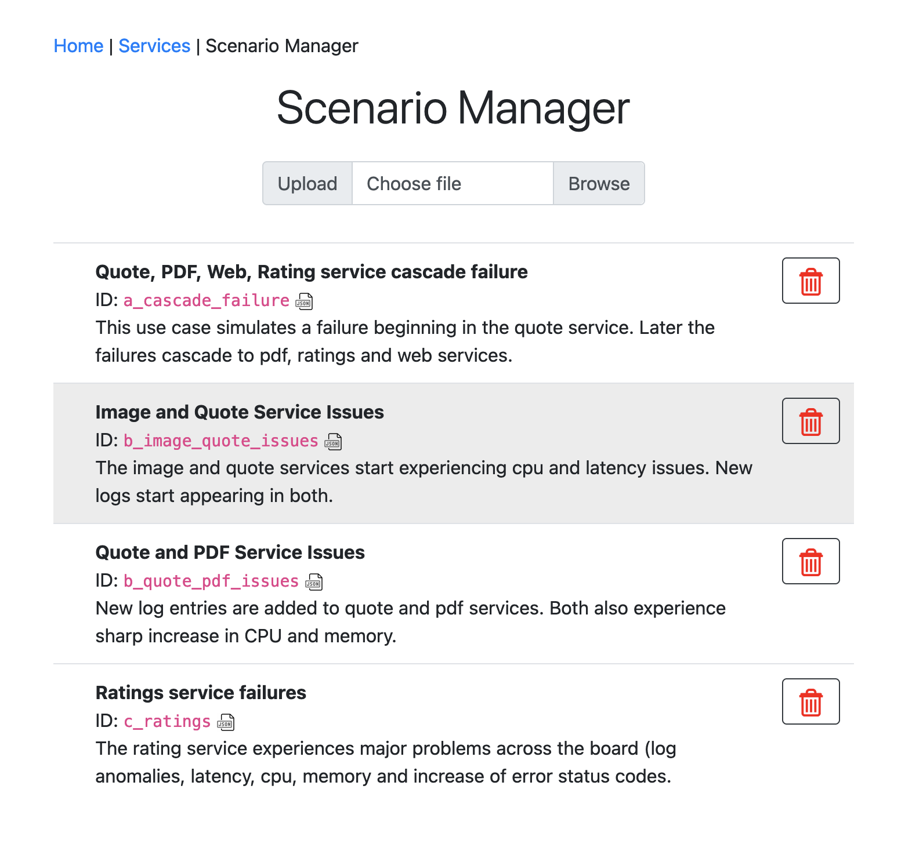

# Anomaly generator

The Quote of the Day Anomaly generator is a separate Node.js web application that allows you to initiate anomalous behavior in any of the QotD services. Out of the box, the generator app comes with a few built in use case anomalies, but you can add your own.

As a point of notation a **use case** or **scenarios** represents a set of steps that when executed, induce (or retract) specific anomalous behaviours in specific components.  An **anomaly** is a measurable variance in an application's performance along one particular dimension (i.e. cpu, memory, latency ...).

## JSON use case definition

Each use case is defined by JSON object.  The object has an identifier, name, description and an array of steps.  The identifier is any string (that can be used as a linux filename), and must be unique across all stored use cases.

```JSON
{
    "id": "a_ratings_failure",
    "name": "Rating service failure",
    "description": "This use case simulates a failure in the ratings service.",
    "steps": [
        ...
    ]
}
```

Each step describes an action that adjusts a varaibility point in the operation of the service.  These are not simulated actions.  If the varability point is to increase memory usage, then the service is instructed to allocate a lof of heap space (and initialize each space with a value) to a point that the increase is noticeable by the metrics collection system (i.e. Prometheus, Instana).  Also in cases like memory, there might also be a corresponding increase of CPU, even if you don't explicitly tell it to, because it is actually allocating memory and filling it with sequential integers.

Variabilty Points (anomaly types)

- CPU usage
- Memory usage
- Endpoints
  - Latency
  - Call return status
  - Dependent Logger
- Independent log messages

## Steps

Each step object specified a `name` (which is used in the user interface as a type of description), and a `service` target.  The current set of service targets include `web`, `quote`, `ratings`, `author`, `image`, `engraving`, and `pdf`.  

Depending upon the type of step there may be additional parameters supplied.  The format and name of the parameters varies according to the step type.

### podLimit

By default an anomaly step is applied to all pods implementing that service.  If you don't want all the pods to generate the anomaly defined in the step, you can add the `podLimit` property in the step with an integer value to limit the number of active pods implementing the anomaly.

```JSON
{
    "id": "ratings",
    "name": "Ratings service failures",
    "description": "The rating service experiences major problems across the board (log anomalies, latency, cpu, memory and increase of error status codes.",
    "steps": [
        {
            "service": "ratings",
            "podLimit": 2,
            "name": "Increase memory usage",
            "type": "memory",
            "value": 8
        },
```

If for some reason after the step is executed, and only some of the pods are instructed to exhibit the anomaly, and for some reason one or more of those pods are deleted (such that they get a new internal IP address), then it will be 5 minutes before the number of pods exhibiting the anomaly is reached again.  This is because internally there is a 5 minute grace period before the Anomaly generator considers a pod permanenantly deleted. 

### Example

In the following full example of a scenario there are 4 defined steps.  The first step tells the rating service to increase its memory usage by a unit of 8.  In this case the units are conceptual and the valid values are 1 to 10, where 10 is close to the point where the default kubernetes deployment limits will hit (and thus risk Kubernetes restarting the pod).

The second step instructs the ratings service to set a delay of 900ms to every HTTP `GET` call on the endpoint `/ratings/:id`, where segments beginnning with a colon (`:`) indicate a variable value.  

The third step is a simple delay of 5 seconds in the ratings service.


```JSON
{
    "id": "ratings",
    "name": "Ratings service failures",
    "description": "The rating service experiences major problems across the board (log anomalies, latency, cpu, memory and increase of error status codes.",
    "steps": [
        {
            "service": "ratings",
            "name": "Increase memory usage",
            "type": "memory",
            "value": 8
        },
        {
            "service": "ratings",
            "type": "latency",
            "name": "Increase latency in primary GET /ratings/:id to 0.9 seconds",
            "endpoint": "GET /ratings/:id",
            "value": {
                "mean": 900,
                "stdev": 200,
                "min": 200,
                "max": 11000
            }
        },
        {
            "name": "Pause 5 seconds",
            "type": "delay",
            "duration": "5000"
        },
        {
            "service": "ratings",
            "name": "Start new independent log - unknown code every 4 seconds in quote service",
            "type": "setLogger",
            "id": "log1",
            "options": {
                "name": "ERROR - unknown code",
                "template": "ERROR - unknown code {{WORD}} found in bucket.",
                "fields": {
                    "WORD": {
                        "type": "word"
                    }
                },
                "repeat": {
                    "mean": 4000,
                    "stdev": 1000,
                    "min": 2000,
                    "max": 8000
                }
            }
        }
    ]
}
```

## Adding and Removing Scenarios

Anomaly scenarios are be defined as JSON objects, as described above.  The **Manager** page allows you to upload new use case definitions, and remove existing ones.



Each defined use case has an ID, a name and a short description shown in the listing.  A scenario can be removed from app by pressing the delete icon, located at the end of each row.

You view the JSON source of each scenario by clicking on the small JSON icon just after the id.  This will open up another tab and display the JSON in a way that makes it easy to copy and paste elsewhere.

You can add your own scenario by uploading the JSON file using the **Browse** button at the top of the page (or by dragging and dropping the JSON file onto the **Choose file** field).  Then press the **Upload** button.  The scenario definition must have a unique ID, that doesn't conflict with any of the current scenario IDs.

This application does not use any persistent storage (to make it easier to deploy). This means that if the pod is destroyed, any uploaded scenarios are gone.  You will have to re-uoload them. So keep a copy locally, just in case.


