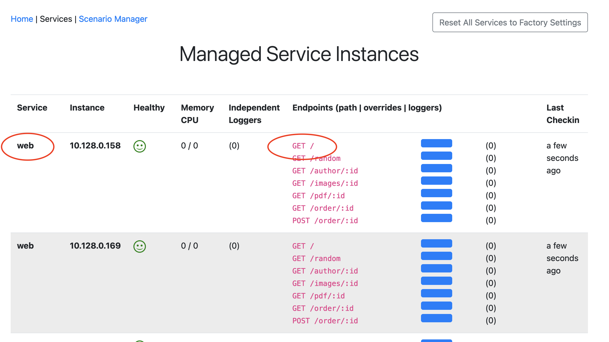

# Anomaly Types

This is a reference document for all defined anomaly types. 

Required properties for all anomalies are the `name`, `type`, and for all but one type `service`.  Depending on the `type` additional properties may be required or optional.

The Anomaly generator comes with several pre-defined use cases which you can use as an example to work from.  They are located in the [usecases](https://gitlab.com/quote-of-the-day/qotd-usecase-generator/-/tree/master/usecases) directory of the [GitLab project](https://gitlab.com/quote-of-the-day/qotd-usecase-generator).

## Reset all services

If you want to stop all anomalies, and reset all services to their factory default settings (presumably the ones that log training was done with), you can use the `reset_all_services` step type.  This type of step has no parameters and will just inform all services to stop anomalous behavior.  

This is the only anomaly type that does not require the `service` property.

Example:

```JSON
{
    "name": "Stop all anomalies in all services",
    "type": "reset_all_services"
}
```

## Delay

A delay step pauses the execution of the anomaly.  The required property is `duration` which is measured in milliseconds.

Example:

```JSON
{
    "name": "Pause for about 2.5 seconds",
    "type": "delay",
    "service": "rating",
    "duration": 2500
}
```

## Memory

A memory anomaly is when the service allocates a significant amount of memory.  This is done by having the application allocate large blocks of memory (~2M) as an array, and then writing an integer into each location.  The number of blocks to allocate is given by the required `value` option. The max value is 10 (self imposed, to prevent the application from crashing).  Any value over 6 is easily noticed by a metric, with 8 being a comfortable value to use to noticed and not be a threat to the integrity of the running instance.

In addition to user heap space being allocated, you will also see a spike in the number of garbage collection events (noticed by Instana).  This is a natural reaction by the Node.js runtime as it tries to manage memory.

Example:
```JSON
{
    "name": "Increase memory usage",
    "type": "memory",
    "service": "quote",
    "value": 8
}
```

## CPU

A CPU anomaly is where the number of CPU calculations increases substantially.  This is done by continually computing random numbers and multiplying them together.  
```node.js
Math.random() * Math.random()
```

The required property `value` is an internal arbitrary measurement. It roughly corresponds to computing the above expression 100K times every 500ms.  A value of 5 to 8 is sufficient to produce a change in CPU usage that is noticeable in both Instana and Prometheus.

Example CPU:
```JSON
{
    "name": "Increase cpu usage",
    "type": "metric",
    "service": "author",
    "metric": "cpu",
    "value": 5
}
```

## Endpoint latency

The latency (additional delay) in the repsonse time of any of the published endpoints is controlled with the `latency` step type.  It expects a `value` object property this property must define a `mean` property which is the average number of milliseconds the service should be delayed.  Providing the optional `stdev` (standard deviation), `min` and `max` values you can allow this value to vary a little (within the defined values).

The other required parameter is the `endpoint` identifier.  This is a compound value with the HTTP verb/method (allowed values: `GET` | `POST` | `PUT` | `DELETE`) beginning the ID, followed by segments of the URL.  Segments starting with a colon (`:`) represent a variable segment.

You can find a listing of all the valid endpoints by viewing the `Services` page of the Anomaly generator.



Example: Latency:
```JSON
{
    "service": "ratings",
    "type": "latency",
    "name": "Increase latency in primary GET /ratings/:id to 0.9 seconds",
    "endpoint": "GET /ratings/:id",
    "value": {
        "mean": 900,
        "stdev": 200,
        "min": 200,
        "max": 11000
    }
}
```

## Health

Example: Make Liveness probe fail (i.e. return 500 status):
```JSON
{
    "name": "Make Liveness probe fail",
    "type": "service",
    "service": "author",
    "action": "sick"
}
```

Example: Make Liveness probe return OK:
```JSON
{
    "name": "Make Liveness probe return OK",
    "type": "service",
    "service": "author",
    "action": "heal"
}
```

### Set logger

New loggers can be added to a service.  These logs are not tied to any specific input call, and are therefore considered "idependent loggers".  The frequency is specified by a delay between calls.  The delay is computed with a normally distributed random value (mean, std dev, min, max). Fields in each log entry can be varied in several different ways with faked data.

The parameters for the log include an `id` which is used later to remove the logger when desired.  This vaue must be unique for all defined independent loggers.  The `name` is optional and used when querying active loggers in a service.  

The `template` is a string that contains the text of the log entry.  This string may contain self-defined variables and are surrounded by a pair of double curley braces.  Each defeined variable is expected to be mentioned in the `fields` property.

Each property of `fields` defines a variable type, and any additional parameters, that will produce a string which is substituted in the template.  Many of these types come from the [Faker](https://www.npmjs.com/package/faker) module, which produces realistic fake data for testing.

A full listing of the supported field types is described in [logger fields](logger_fields.md)


Example: a SQL like log message.

```JSON
{
    "name": "Request SQL",
    "id": "request-sql",
    "delay": {
        "min": 100,
        "max": 10000,
        "skew": 1
    },
    "template": "{{TIMESTAMP}} Query: SELECT * FROM {{TABLE}} WHERE {{TABLE}}_id='{{VALUE}}' {{RETURN_CODE}} User: {{USERID}} Source: {{IP}}",
    "fields": {
        "TIMESTAMP": {
            "type": "utcTimestamp"
        },
        "TABLE": {
            "type": "pickWeighted",
            "options": [
                { "value": "users", "weight": 8 },
                { "value": "catalog", "weight": 1 },
                { "value": "inventory", "weight": 1 },
                { "value": "comments", "weight": 2 }
            ]
        },
        "VALUE": {
            "type": "randomInt",
            "min": 100000,
            "max": 999999
        },
        "RETURN_CODE": {
            "type": "pickWeighted",
            "options": [
                { "value": "({{ROWS}}) rows returned", "weight": 10 },
                { "value": "null", "weight": 2 },
                { "value": "error", "weight": 1 }
            ]
        },
        "ROWS": {
            "type": "randomInt",
            "min": 1,
            "max": 100
        },
        "USERID": {
            "type": "userName"
        },
        "IP": {
            "type": "ip"
        }
    }
}
```

## Call Distribution Overrides

A call service override definition allows us override the normal call status (HTTP status) return for any endpoint used in the application.  A special identifier is associated with each service's endpoints that can be overridden.  

Example `addCallDistribution` Step definition:

```json
{
    "name": "5 out of 10 calls to the /ratings/:id service results in a 500 Server Error response.",
    "type": "addCallDistribution",
    "service": "rating",
    "pathId": "ratings_id",
    "options": 
        [
            { "code": 0, "weight": 6 }, 
            { 
                "code": 500, "weight": 4, 
                "payload": "Uh oh",
                "log": {
                    "template": "Unexpected internal error: {{type}}",
                    "fields": {
                        "type": {
                            "type": "pickWeighted",
                            "options": [
                                { "value": "disk", "weight": 6 },
                                { "value": "memory", "weight": 4 }
                            ]            
                        }
                    }
                }
            }
        ]
}
```

In this definition there are two overrides defined, the first is a special one with a code value of `0`.  The weight of this call response is 6 out of every 10 times (the total is obtained by adding all the weights of all the overrides for this endpoint, 6+4=10).  The status of 0 means that the call should not be overriden, and instead processed as normal.  The second value in this array defines a code of `500`, with a weight of 4 out of 10.

The `payload` property defines the value that the message body should return.  

The `log` property defines the log entry that will be added to the logs each time this call response is activated.  The `template` and `fields` property of `log` are of the same form as the default and induced loggers (above).

The full listing of internal and external endpoints that can be overriden are listed in the table below.

**Table: Call Service Overrides Endpoint IDs**

| Service      | Method | Endpoint ID     |  Endpoint URL     |
|--------------|--------|-----------------|-------------------|
| Rating       | GET    | `rating_id`     | `/ratings/:id`    |
| Web          | GET    | `daily`         | `/`               |
| Web          | GET    | `random`        | `/random`         |
| Web          | GET    | `author_id`     | `/author/:id`     |
| Web          | GET    | `images_id`     | `/images/:id`     |
| Web          | GET    | `pdf_id`        | `/pdf/:id`        |
| Web          | GET    | `order_id`      | `/order/:id`      |
| Web          | POST   | `post_order_id` | `/order/:id`      |
| Quote        | GET    | `daily`         | `/daily`          |
| Quote        | GET    | `random`        | `/random`         |
| Quote        | GET    | `quotes_id`     | `/quotes/:id`     |
| Author       | GET    | `authors_id`    | `/authors/:id`    |
| Author       | GET    | `images_id`     | `/images/:id`     |
| Engraving    | POST   | `order`         | `/order`          |
| PDF          | GET    | `pdf_id`        | `/pdf/:id`        |
| Image        | GET    | `images_id`     | `/images/:id`     |

There are four call distribution step types defined

**addCallDistribution**

Adds a new call distribution override.  If one already exists for this endpoint it will be replaced.  The above example shows a step of this type.

**updateCallDistribution**

Changes the properties of a currently active call distribution.  The format is the same as for `addCallDistribution`.

**removeCallDistribution**

Removes a currently active call distribution override. There are no options required or this step, however the `pathId` is required.

```json
{
    "name": "Removes override for ratings service main endpoint",
    "type": "removeCallDistribution",
    "service": "rating",
    "pathId": "ratings_id"
}
```

**resetCallDistributions**

Resets all call service overrides for the service.  This means any overrides created by the anomaly generator will be removed.  If the service was defined with any overrides, using ConfigMaps, then these are reinstated. The `pathId` and `options` properties are not required.

```json
{
    "name": "Resets call override to factory default settings",
    "type": "resetCallDistributions",
    "service": "rating"
}
```
