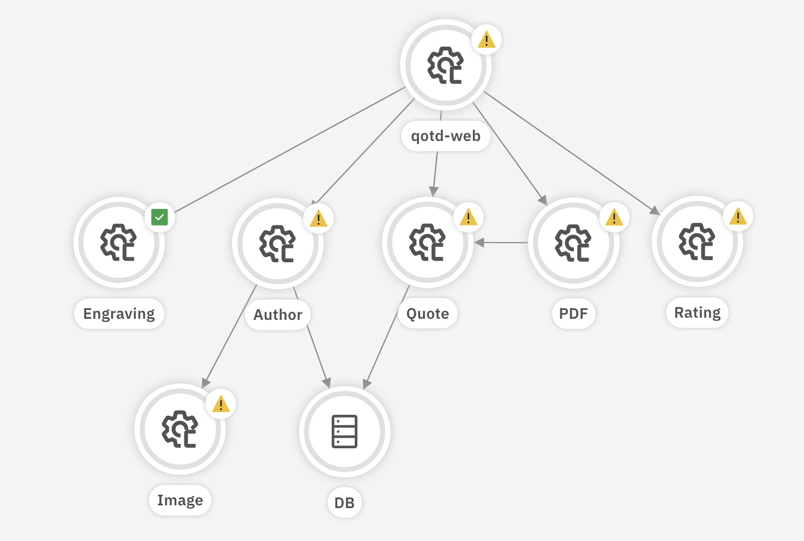

# Quote of the Day Architecture Details

The QotD demo application is a collection of Node.js services and a MariaDB database. All of the services and database are packaged as containers, and can be deployed just as containers on hosts.  The original intent however is for the application to be deployed to a Kubernetes cluster, which is why there is a provided Helm option, and sample OpenShift and generic Kubernetes resource files.

Each service generates its own logs and provides metrics.  Prometheus compatible metrics can be scraped off of each service at the `/metrics` endpoint.  Each service is also instrumented for Instana, which also collects metrics.

## Components

Each service in this demo application is managed by its own [GitLab project](https://gitlab.com/quote-of-the-day). Each component is implemented with Node.js.  A common node package contains a [framework for developing a QotD service](https://gitlab.com/quote-of-the-day/service-control) such that it is capable of generating anomalies, as specified by the Anomaly Generator.  

Anomalous behaviors can be any of the following.

- Dependent and independent log messages
- CPU usage
- Memory Usage
- Latency
- HTTP response codes (i.e. 400, 404, 500, ...)

Both dependent and independent log entries can be added.  Independent log entries appear with a certain frequency, and are independent of incoming load.  Dependent log entries are written each time the endpoint they are attached to is called.  These log entries will vary with the overall load.

When it comes to CPU, memory and latency, the changes are real.  For example to increase the CPU usage, the code continuously computes random numbers.  When it comes to memory consumption, large arrays are created and stuffed with integera (which not surprisingly causes a temporary increase in CPU usage).  Every business service already has a built in latency of 100ms, but this can extended with the anomaly inducer to many seconds.

Other anomalies include the overriding of status code responses to services.  For example it can be specified that a specific endpoint on a service will fail with 500 error 2 our of 5 times it is called.  And when it does fail a different log message(s) are written to the log.  


QotD Service Architecture

### Web 

The [web](https://gitlab.com/quote-of-the-day/qotd-web) component is the web front end of the application and the starting point for all scenarios in the application.  

### Quote 

The [quote](https://gitlab.com/quote-of-the-day/quote-service) service provides the quotes to the web tier and the PDF service.  It queries a MariaDB database with over 500 quotes in it.  The quote database includes only the quote, author name and genre.  It does not include author bio information.  This is provided by the author service.

### Rating

The [rating](https://gitlab.com/quote-of-the-day/qotd-ratings-service) service provides a rating.  The rating is randomly generated.  The rating is 0 to 5 stars, with half stars allowed, which effectively permits an integer value of 0 to 10 (exclusive).

### Author

The [author](https://gitlab.com/quote-of-the-day/qotd-author-service) service provides biographical information of an author.  A link around the author's name driects the browser to the author's page.  The web front end calls the author service to get the author's biographical information (as found on Wikipedia), and also calls it for the author's image.  The author service then calls the image service to get an actual image.  

### Image

The [image](https://gitlab.com/quote-of-the-day/qotd-image-service) service provide JPG images of authors.

### PDF

The [pdf](https://gitlab.com/quote-of-the-day/qotd-pdf-service) service generates a new PDF resource with the quote and author name in it.  The PDF is generated on the fly with the help of the [`pdf-lib` module](https://www.npmjs.com/package/pdf-lib).

## Anomaly generator

In version 4.0 of QotD, the direction of connection between the Anomaly generator and the app services has switched.  In this release each service pod polls the Anomaly generator to get its current desired "anomaly" state.  In this way, no matter how many pods are running (or deployments to VMs) there are, each instance of the service will exhibit the desired anomalous behavior (except when [`podLimits`](anomaly_generator.md#podlimit) are used of course).

This means that each service Deployment must provide an environment variable (`ANOMALY_GENERATOR_URL`) that points to the exposed URL of the Anomaly generator, with segments that specific the type of service it is.  For example the Author service deployment resource specifies the Anomaly generator URL as

```yaml
env:
- name: ANOMALY_GENERATOR_URL
    value: "http://qotd-usecase-qotd-load.apps.mycluster.com

```

By default each application pod polls the anomaly generator every 5 seconds.  This value can be set with the Anomaly generator environment variable `POLLING_FREQUENCY` in each service deployment configuration. The default value is 5000 (ms).

### Default service configurations

When the Anomaly generator first starts it reads a JSON object object from the internal file `/app/config/services_defaults.json` that containts the "factory default settings" configuration for all services in the application.  A Kubernetes ConfigMap can be used to define this file outside of the container (mapping the configmap to the `/app/config` directory).  This allows the initial definition of indepenent loggers like the heatbrat logger, that writes to the log independent of load volume.

