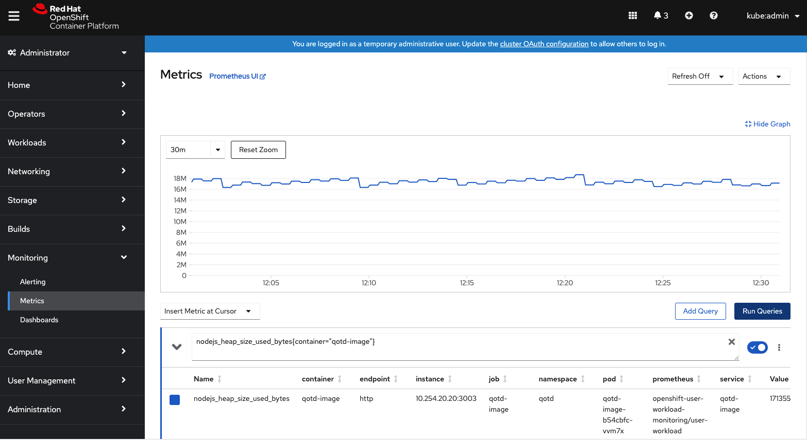

# Prometheus Configuration

As a convenience to those using or wanting to use Prometheus on OpenShift to collect QotD metrics and generate alerts, we have included the OpenShift assets for doing so in the `resources/prometheus` (thanks Ricardo) folder. For deploying such assets to your OpenShift cluster, we assume you will use an OpenShift cluster administrator userID. Otherwise, you'll need to take additional steps for monitoring and collecting QotD metrics (doing so using a **non** administrative userID is beyond the scope of this document). Also, we assume you are using OpenShift version that supports monitoring of user-defined projects (for more details see [Enabling monitoring for user-defined projects](https://docs.openshift.com/container-platform/4.6/monitoring/enabling-monitoring-for-user-defined-projects.html) -- the commands below were tested on OpenShift v4.6).

1. First navigate to the `resources/prometheus` folder on your local workstation.

1. Using the OpenShift CLI, create the `cluster-monitoring-config` `ConfigMap` object in the `openshift-monitoring` project:

    ```shell
    oc apply -f cluster-monitoring-config.yaml
    ```

1. Wait for all pods in the `openshift-user-workload-monitoring` project to come up:

    ```shell
    oc get pods -n openshift-user-workload-monitoring
    ```

    ```shell
    NAME                                   READY   STATUS    RESTARTS   AGE
    prometheus-operator-8665f65566-g9mwx   2/2     Running   0          7d4h
    prometheus-user-workload-0             4/4     Running   1          7d4h
    prometheus-user-workload-1             4/4     Running   1          7d4h
    thanos-ruler-user-workload-0           3/3     Running   0          7d4h
    thanos-ruler-user-workload-1           3/3     Running   0          7d4h
    ```

1. Create a `ServiceMonitor` instance for QotD.

    ```shell
    oc apply -f service-monitor.yaml
    ```

1. Deploy the the alerting rules.

    ```shell
    oc apply -f rules_author.yml -f rules_image.yml -f rules_rating.yml -f rules_web.yml
    ```

1. Once all steps above are completed, wait about a minute or so and then validate that Prometheus metrics from QotD are scraped as expected by going to your OpenShift console and navigating to the `Monitoring` -> `Metrics` view. On the `Metrics` panel, execute the `nodejs_heap_size_used_bytes{container="qotd-image"}` query to gather the `nodejs_heap_size_used_bytes` metric from the container named `qotd-image`:

    

